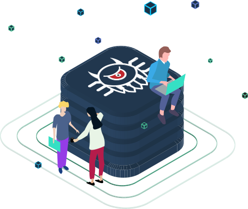

.. rst-class:: hero
Multi-protocol translation software
###################################

The MIDIMonster is an universal control and translation tool for most show
control protocols in the entertainment industry - and lots more besides

.. container:: buttons

	.. rst-class:: button secondary
	`Download </download.html>`_

	.. rst-class:: button primary
	`Get started </getStarted.html>`_

.. rst-class:: hero-img

.. rst-class:: centered
Wide range of supported protocols
#################################

Mix and match the protocols relevant to your use-case, and translate seamlessly
between them.

.. container:: modules

	.. include:: backends/midi_card.rst
	.. include:: backends/artnet_card.rst
	.. include:: backends/rtpmidi_card.rst
	.. include:: backends/sacn_card.rst
	.. include:: backends/osc_card.rst
	.. include:: backends/maweb_card.rst
	.. include:: backends/openpixelcontrol_card.rst
	.. include:: backends/ola_card.rst
	.. include:: backends/input_card.rst
	.. include:: backends/jack_card.rst

.. rst-class:: centered
Powerful programming environment included
#########################################

Create fully or partially automated shows, triggerable patterns, simplified control interfaces
or something entirely new! The MIDIMonster programming backends give you full programmatic control
over devices on any supported protocol. You can even extend the MIDIMonster itself to connect to
custom devices or services.

.. container:: modules

	.. include:: backends/lua_card.rst
	.. include:: backends/python_card.rst
	.. include:: backends/loopback_card.rst

Expressive and easy-to-learn configuration syntax
#################################################

Browse our library of example configurations and user contributed use-case descriptions to get
a feeling of what is possible.

.. container:: buttons

	.. rst-class:: button secondary
	`Example configurations <https://github.com/cbdevnet/midimonster/tree/master/configs>`_

	.. rst-class:: button primary
	`Get started </getStarted.html>`_

.. rst-class:: two-paragraphs
Dedicated and helpful community
###############################

.. container:: text

	Do you have questions, ideas for new features or backends, issues you would
	like to bring up or did you find a bug? We're happy to hear from you, both
	via our issue tracker and our `IRC chat room <https://webirc.hackint.org/#irc://irc.hackint.org/#midimonster>`_

	Do you have a novel use case in mind, or do you want to show off an awesome
	project realized with the MIDIMonster? The Knowledge base is the place to
	share your insights with other users!

.. container:: buttons

	.. rst-class:: button secondary
	`Knowledge Base <https://kb.midimonster.net/>`_

.. rst-class:: centered
Be a part of it!
################

You like the MIDIMonster project and want to contribute? Sounds great! We have gathered all the information
on how you can help in developing, promoting and growing this open source project

.. container:: buttons

	.. rst-class:: button secondary
	`How to contribute <https://kb.midimonster.net/dev/Contributing.html>`_
